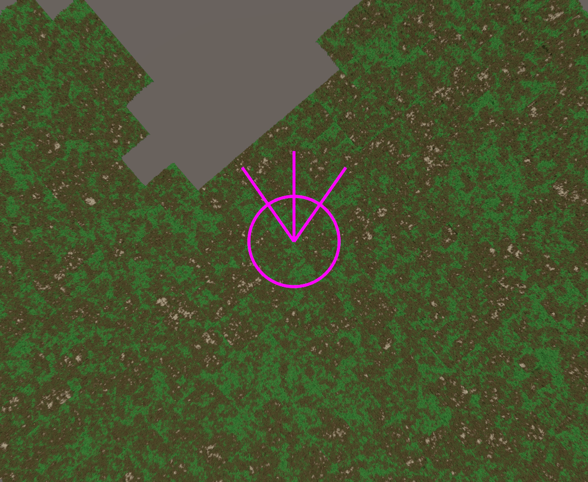
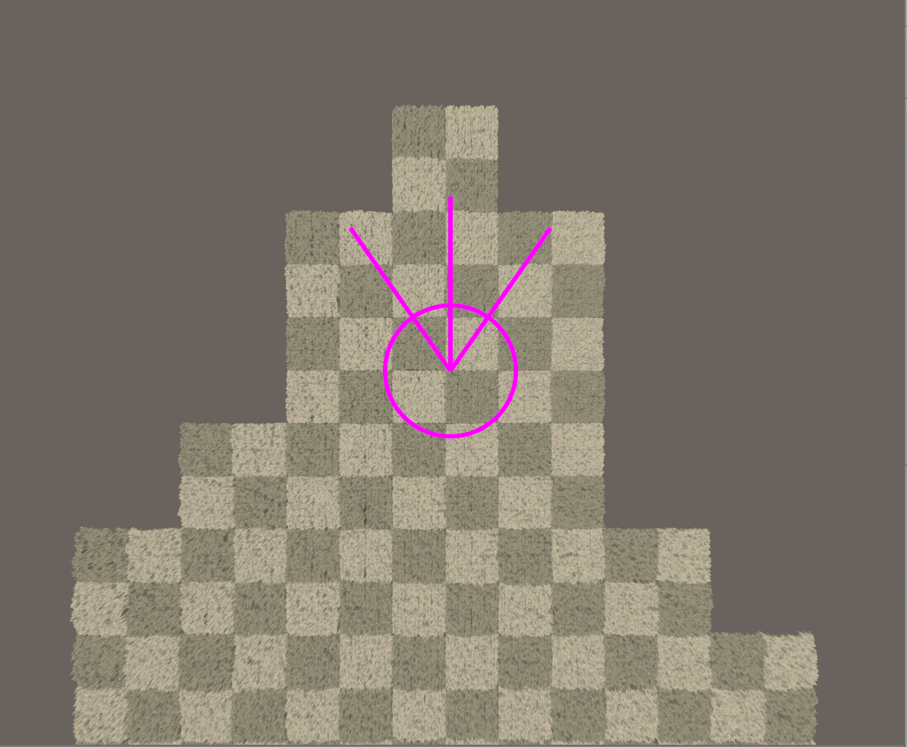
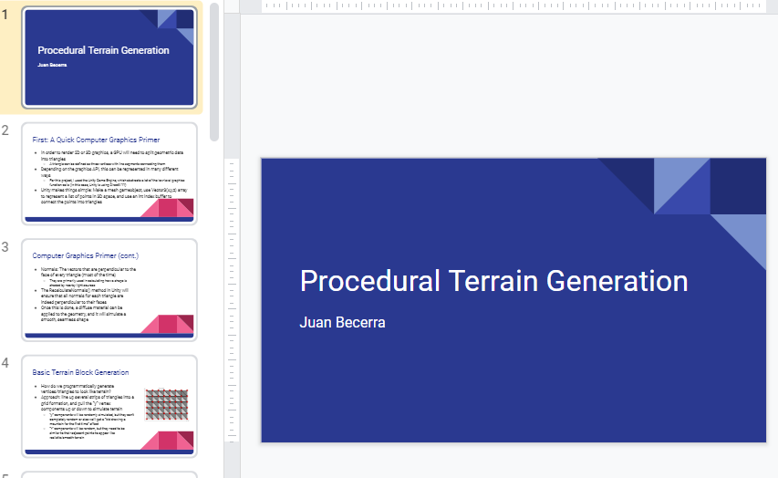
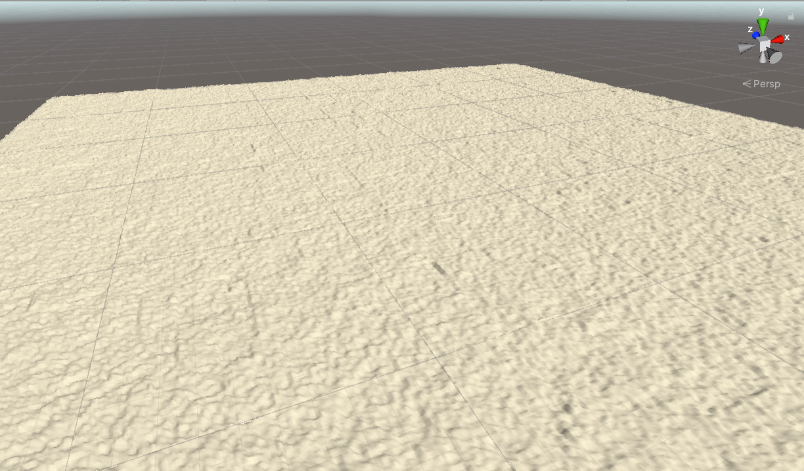

# TerrainEngine
Terrain generation engine built in Unity. For Boise State CS 497 - Advanced Computer Graphics.

A Trello task list can be found here: https://trello.com/b/A6eJpKhz/terrain-engine

# Goals

The goal of this project is to develop a real-time procedural terrain generator that implements multiple fractal-based techniques, including fractal-noise heightmap generation, hydraulic and thermal erosion, and biome partitioning. The project is developed using Unity to allow for user interaction and dynamic model placement along the procedurally generated terrain.

I believe that achieving these effects will be most effective in parts. This is what I believe my sequence of tasks to handle should include:

-	Create prefab pieces of geometry that read in heightmap information to generate vertex positions
-	Procedurally spawn these pieces of geometry based on proximity and viewport
-	Use fractal-based algorithms to generate heightmaps that seamlessly connect to each other
-	Use large, procedurally-generated textures to “partition” regions into biomes (like mountains, fields, and rivers)
-	Blend materials together on geometry based on heightmap deltas and biome regions
-	Use prefab models to place objects on geometry based on biome regions

As I work on this project, my tasks will likely be more complex, but I feel that this is a good set of goals to start off with.

# Log
### 4/17/2020 - Refactoring and Biome Partitioning Prep

After a bit of a break, I have decided to refactor my entire generation pipeline in preparation for some of the more advanced features coming up. The pipeline now takes into account a cartesian coordinate system that queries both a biome map and a heightmap map, which takes care of some of the dependencies issues I would have had with the old implementation. In addition, I’ve opened up the pipeline to allow for bump/normal maps in addition to the regular texture generation. My next feature will be the biome generation algorithm.

### 3/27/2020 - Procedural Texture Generation

In this update, I utilized the UV mappings of individual blocks of geometry to experiment with procedural material generation. I want to eventually implement all sorts of great material shader techniques, like bump and specular maps, but I wanted to mainly focus on color at first. I made a rudimentary algorithm for generating textures based off of the height of a pixel’s heightmap value. I then interpolated between green, brown, and white colors to simulate grass, mountain, and snow respectively. This is still pretty basic as it does not read off of a master biome map, but it should give me a basic approach for crossing off future goals.

### 3/20/2020 - Procedural Block Generation

In this update, I implemented procedural block generation. This is accomplished using two different components:
-	The player’s view frustum
-	The player’s position/vicinity

Using a few view raycasts, circle intersection points, local-to-world point calculations, and cartesian-coordinate block querying, we are now able to generate new blocks of terrain that didn’t previously exist. This is significant as this modular approach sets this project up for procedural biome partitioning and material/shader generation (per block). 

### 3/13/2020 - Procedural UV Mapping Setup and HM Placement Setup

In this update, I set up procedural UV mapping for generated blocks of terrain. This will allow me to utilize Unity's shaders to create procedural materials (textures, normal maps, etc…). This depends on the biome mapping, which I will focus on in a future update. Currently, the generated terrain is covered using a default diffuse tile texture. In addition, I’ve implemented frame-by-frame calculations for rays casted by the player’s frustum and a circle generated around the player’s position. Using these components, I’ll be able to set up procedural placement.

### 3/06/2020 - Off-Week

Went to Vegas this week for the Mountain West Basketball Tournament. Didn't have much time to sit down and implement features.

Go Broncos!

### 2/28/2020 - Feature Planning

In this update, I pushed a bit of a work, but I was primarily focused on planning out how I would develop the rest of the project beyond my initial brainstorming. I created a slideshow that I presented to the BSU Visual Lab which showed off some of my currently implemented ideas, as well as some ideas that I wanted to eventually implement.

The slides can be found here: https://docs.google.com/presentation/d/1KS8lYTnNKSGSGAwerPso5T7KUpoCsoR7gVtVWvVw958/edit?usp=sharing

In summary, I want to build off of my current work and implement some popular terrain generation algorithms/techniques. These techniques include:

- Material Interpolation
- Procedural Block Placement
- Heightmap Displacement
- Hydraulic Erosion Bumpmap Generation
- Biome Mapping/Partitioning
- Procedural Material Application
- Procedural Model Placement

### 2/21/2020 - Diamond Square and Heightmap Stitching

In this update, I implemented the diamond-square algorithm for generating heightmaps of size (2n+1) by (2n+1). In addition, I developed a data structure for storing heightmap information in a cartesian coordinate system. This way, adjacent heightmaps can be “stitched” so that newly generated MeshGenerator objects seamlessly blend into other adjacent objects. I have effectively generated the base terrain required for the rest of the project, which should put me in a good place for procedural generation. There is still work to be done on heightmap generation for extra generation layers that add extra detail and remove diamond-square artifacts. In addition, I will begin adding user interaction so that I can begin procedural generation using the player vicinity and camera frustum.

### 2/14/2020 - Setup for Mesh Placement + Heightmap Generation

In this update, I created a new prefab object that generates MeshGenerator objects in a grid formation. In addition, the MeshPlacer generates indexed heightmaps that the MeshGenerators read in order to generate their geometry. Currently, only random RGB values are generated for the corners of the ((2^n) + 1)-sized heightmaps. However, in future updates, I will be using the diamond-square algorithm and other permutations to generate smooth noise fields for each MeshGenerator object that connect to other MeshGenerator object heightmaps. In addition, I will set up the MeshPlacer script to add new MeshGenerator objects based on vicinity and the viewport of the player character. 

### 2/7/2020 - Basic Terrain Grid

In this update, I created a new 3D Unity project with a single empty object called a "MeshGenerator". It contains a Mesh Filter and Mesh Renderer subcomponent, in addition to a Mesh Generator C# script, which is where vertices and triangles are actually generated. This script creates a mesh and assigns it to the MeshFilter subcomponent of the object, and then calls a CreateShape() method. This method first creates a Vector3 array of size "(x + 1) * (y + 1)" called "vertices", then programmatically fills it with Vectors x and z values aligned in a grid, while y values are assigned using a Perlin Noise function. Another integer array called "triangles" keeps track of vertex indices generated in the "vertices" array. This array programmatically assigns the correct vertices together to create triangles with back-face culling. Once both arrays are generated, the mesh data is cleared, assigned with new vertices and triangles, and the RecalculateNormals() method is called to properly light the mesh.
